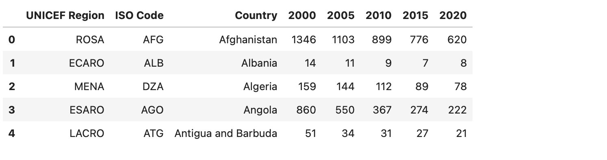
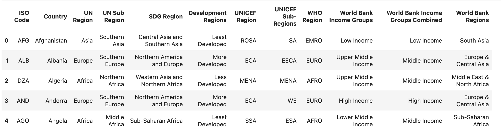

## Project: Maternal Mortality Rate Analysis Among Countries (Based on UNICEF data)
This project uses data from the UNICEF [website](https://data.unicef.org/topic/maternal-health/maternal-mortality/). UNICEF was established in 1946 by the United Nations General Assembly to provide emergency food and healthcare to children and mothers in countries that had been devastated by World War II. UNICEF's name was originally the United Nations International Children's Emergency Fund, but was shortened to the United Nations Children's Fund in 1953. UNICEF has a global presence in over 190 countries and territories.

The data used in the project is explained below:

    - countries: Has a list of countries with MMR rates in years 2000, 2005, 2010, 2015, 2020
    - regions: Has a list of countries with regional information, income group and development level.

Screenshots of the data are shown below;
 
 

### Descriptive Analysis of MMR Data
We were able to run some analysis on MMR data as described below:
1. Global distribution of MMR: In section 1 we plotted a map that shows MMR across countries using ploty.express
2. MMR trends with the passage of years: In section 2, we showed how MMR has declined over the years and how each continent is doing over the years
3. Further Analysis into Africa data: Africa has the highest maternal mortality rate, In section 3, we grouped Africa by Subregion and narrow down to top 7 countries in Africa with highest mortality rate.
4. MMR trends by Development and IncomeGroup. In section 4, we looked at how Development and IncomeGroup has impacted MMR

### Required Packages
Most of the import statements used in the project comes preinstalled except plotly. To instll plotly, use
    `pip install plotly`
